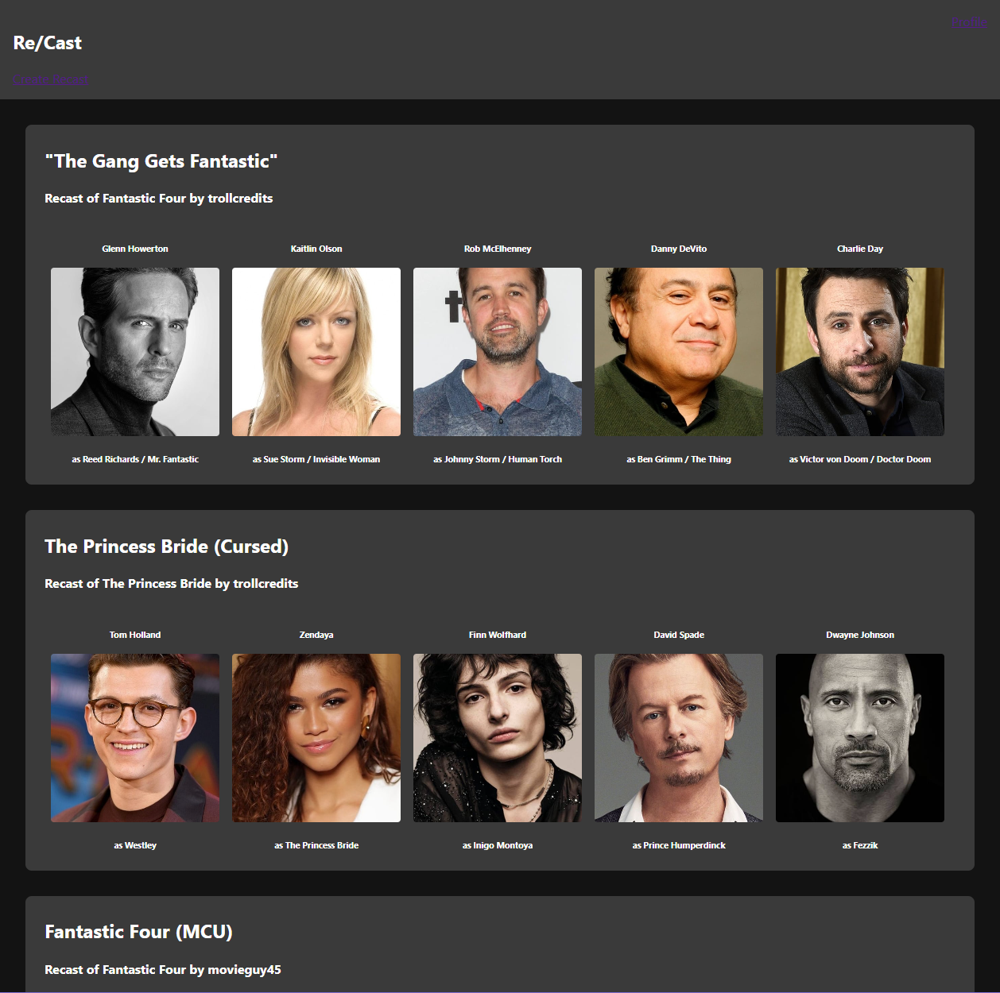

ReCast
URL: https://recastfe.herokuapp.com/
Backend: https://github.com/CueBitts/ReCast-API

ReCast is an app for re-imagining the casts of your favorite movies! Select any movie, recast any or all of the characters with actors of your choosing, and post it for other users to see.
ReCast is a full-stack social media application built with a React frontend and a Django/Postgresql backend. The app makes use of the TMDB API for movie and actor data, and stores user and recast data in Postgres. The site supports full CRUD functionality.

Users that are not signed in will be able to Sign in/Sign up
Users that are not signed in will be able to view and sort Recasts
Users that are not signed in will be able to view Recasts for a specific movie
Users that are not signed in will be able to view Recast detail pages
Users that are signed in will be able to do all of the above 
Users that are signed in will be able to view and edit their profile
Users that are signed in will be able to create and delete Recasts

I encountered big hurdles creating my Django backend, particularly figuring out ForeignKey relationships and how those affected my views and serializers. The frontend was not that difficult but I did not have the time to style it how I wanted, fix major bugs, and implement all the features I wanted.